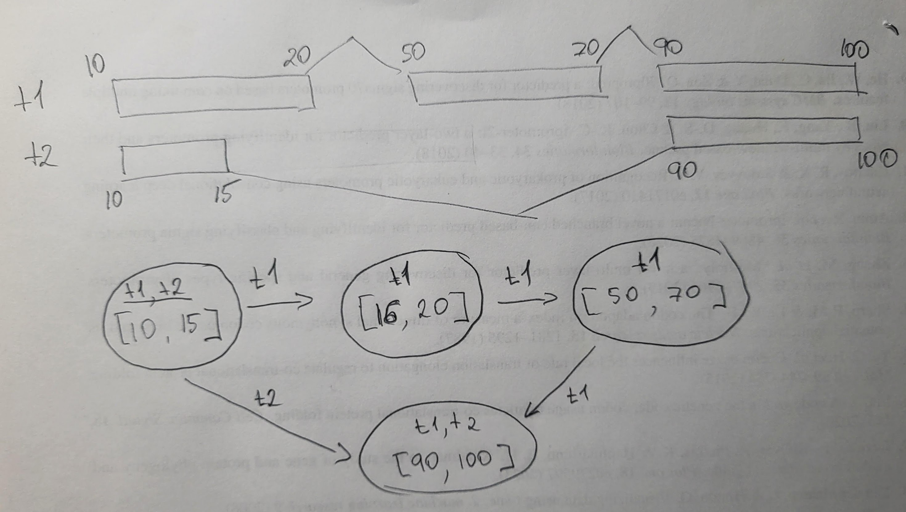
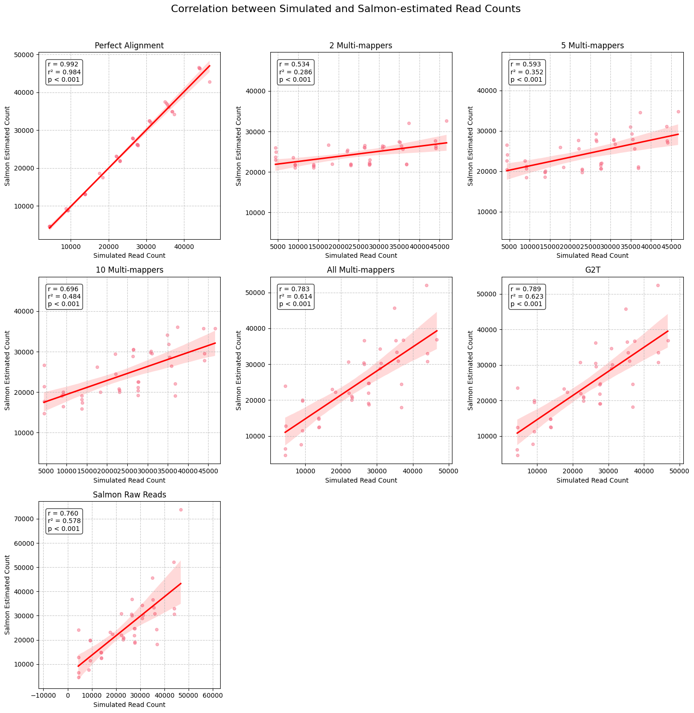

# Intro

Salmon is frequently used to estimate abundance of transcripts from RNA-seq data. Fast and accurate, this pseudo-alignment method relies on the accuracy of the sequence and assumes low sequence divergence. The software does permit analysis using pre-computed alignments, however those are required to be in the transcriptomic coordinate space. However, numerous challenges are associated with performing traditional alignment to transcriptome, be it with HISAT2, Bowtie, STAR or other methods.

Most protein-coding gene (22,083 in the CHESS database), multiple transcripts, in many cases upwards of 10. Most of these transcripts are splice-variants of each other, and share much of their sequence. Traditional aligners such as Bowtie and HISAT2 are not designed to report all possible mappings as such exhaustive searches can slow down the algorithms to a crawl. WHile not typically an issue in the genomic space where recurrent motives do exist but are not common, presence of repeated sequence due to alternative splicing in transcriptomic space in addition to regular inter-locus homology makes alignment particularly challenging.

While in most cases, estimating abundance with raw data using SALMON circumvents the issue due to the pseudoalignment algorithm specifically designed for transcriptomic space, this poses other challenges. For one, multiple novel isoforms may exist, and reads can be incorrectly placed into the known transcripts due to less stringent consideration of genomic space outside the transcriptome.

Secondly, in rare cases, significant sequence divergence may impede the pseudoalignment algorithm of SALMON, while traditional aligners may still be able to do adequate job of the data.

Thus stands a question, if an aligner fails to report all transcriptomic multimappers, does that have an impact on the accuracy of transcript quantification by SALMON?

## Experimental design

We designed an simple simulation experiment to control the coverage of multimapper reporting and assess performance of SALMON. 

We chose to use the HIV-1 reference genome and transcriptome annotation as the model for our experiment. This particular viral genome is well suited for the study, since the virus mutates extraordinarily fast, making pseudoalignment challenging, and because it is known to transcribe a very diverse repertoire of spliced transcripts (41 being the conservative estimate), with each transcript sharing part of the sequence with multiple other transcripts. Furthermore, the genome is extremely compact at under 10KB in length, making it ideal for a small targeted simulation study.

We extracted the reference transcriptome as follows and used it to build a salmon index
```bash
gffread -g K03455.1.fasta -w K03455.1.transcripts.fasta K03455.1.gtf
salmon index -t K03455.1.transcripts.fasta -i K03454.salmon -k 31
```

Next, we built a simple dictionary of all nmers for the target read length of 100bp, recording all transcripts and coordinates within those transcripts for each read.

```python
# build index of nmers in the transcripts

read_positions = dict()
for record in SeqIO.parse(transcript_fasta_fname, 'fasta'):
    seq = str(record.seq)
    for i in range(len(seq) - read_len + 1):
        read = seq[i:i+read_len]
        if read not in read_positions:
            read_positions[read] = []
        # add the transcript id and the position of the read in the transcript
        read_positions[read].append((record.id, i))
```

In order to provide some variance in the expression of each transcript we simualted simple fold-change in abundance of each transcript

```python
transcript_read_data = dict()
for record in SeqIO.parse(transcript_fasta_fname, 'fasta'):
    transcript_read_data[record.id] = dict()
    transcript_read_data[record.id]["depth"] = random.randint(1, 10)
    transcript_read_data[record.id]["len"] = len(record.seq)
    
# write out the simulated transcript settings to a tsv file
with open(read_data_fname, 'w') as outFP:
    outFP.write('transcript_id\tdepth\tlen\n')
    for transcript_id, data in transcript_read_data.items():
        outFP.write(f"{transcript_id}\t{data['depth']}\t{data['len']}\n")
```

Reads were then simulated to the desired depth for each transcript
```python
with open(reads_fname, 'w') as outFP:
    for record in SeqIO.parse(transcript_fasta_fname, 'fasta'):
        depth = transcript_read_data[record.id]["depth"]
        seq = str(record.seq)
        for i in range(len(seq) - read_len + 1):
            read = seq[i:i+read_len]
            for d in range(depth):
                outFP.write(f">{record.id}_{i+1}_{d}\n{read}\n")
```

Next, using the known transcriptomic coordinates for each read, we could convert each read into genomic space as follows. All additional methods referenced here are accessible in my [collection of genomic methods](https://github.com/alevar/genomic_scripts/blob/main/definitions.py).

```python
# we now need to produce genomic alignments for the data so that we can run mudskipper and ocmpare results

# iterate over the reads and convert position on the transcript to genomic position
with open(genomic_sam_fname, 'w') as outFP:
    # build the header
    outFP.write(f"@HD\tVN:1.0\tSO:unsorted\n")
    # get list of genomic seqids from the reference_fasta_fname
    for record in SeqIO.parse(reference_fasta_fname, 'fasta'):
        outFP.write(f"@SQ\tSN:{record.id}\tLN:{len(record.seq)}\n")

    for record in SeqIO.parse(reads_fname, 'fasta'):
        read_id = record.id
        read = str(record.seq)
        tid, pos = read_id.rsplit('_',2)[:2]
        pos = int(pos)-1
        
        # get the chain for the transcript
        chain = transcript_chains[tid]['chain']
        strand = transcript_chains[tid]['strand']
        seqid = transcript_chains[tid]['seqid']

        # get the genomic position
        genomic_start = definitions.trans2genome(chain, strand, pos)
        genomic_end = definitions.trans2genome(chain, strand, pos + read_len - 1)
        genomic_chain = definitions.cut(chain, genomic_start, genomic_end)

        # build cigar string from chain
        cigar = definitions.chain2cigar(genomic_chain)

        # write out the read
        outFP.write(f"{read_id}\t0\t{seqid}\t{genomic_start}\t255\t{cigar}\t*\t0\t0\t{read}\t*\n")

# sort the sam file
cmd = f"samtools sort -o {genomic_sorted_fname} {genomic_sam_fname}"
print(cmd)
subprocess.run(cmd, shell=True, check=True)
```

Lastly, we needed to produce transcriptomic alignments controling the number of multimappers reported. Using the precomputed index of nmers, we obtained a full list of transcripts and coordinates where that read is found. We randomly chose the primary alignment for each read and reported up to N multimappers after that at 2, 5, 10 and everything. As a control, we also produced a perfect transcriptomic alignment with only the correct position reported for each read.

```python
# now for each read we need to produce a SAM record including multimappers for each fraction. if 0 - only the primary alignment is included
for nm in num_multi:
    # first write the header
    sam_fname = outdir / f"reads_{nm}.sam"
    sam_genomic_fname = outdir / f"reads_{nm}_genomic.sam"
    with open(sam_fname, 'w') as outFP, open(sam_genomic_fname, 'w') as outFP_genomic:
        outFP.write(f"@HD\tVN:1.0\tSO:unsorted\n")
        outFP_genomic.write(f"@HD\tVN:1.0\tSO:unsorted\n")
        for record in SeqIO.parse(transcript_fasta_fname, 'fasta'):
            outFP.write(f"@SQ\tSN:{record.id}\tLN:{len(record.seq)}\n")
        for record in SeqIO.parse(reference_fasta_fname, 'fasta'):
            outFP_genomic.write(f"@SQ\tSN:{record.id}\tLN:{len(record.seq)}\n")
        
        # now write the reads
        for record in SeqIO.parse(reads_fname, 'fasta'):
            read_id = record.id
            read = str(record.seq)
            tid, pos = read_id.rsplit('_',2)[:2]
            # convert to 0-based
            pos = int(pos)-1
            # get the multimappers
            multimappers = read_positions[read]
            random.shuffle(multimappers)
            multimappers = multimappers[:nm]

            # pick primary alignment
            primary = multimappers[0] if len(multimappers) > 0 else (tid, pos)
            outFP.write(f"{read_id}\t0\t{primary[0]}\t{primary[1]+1}\t255\t{read_len}M\t*\t0\t0\t{read}\t*\n")
            # write out the genomic alignment
            chain = transcript_chains[tid]['chain']
            strand = transcript_chains[tid]['strand']
            seqid = transcript_chains[tid]['seqid']
            genomic_start = definitions.trans2genome(chain, strand, pos)
            genomic_end = definitions.trans2genome(chain, strand, pos + read_len - 1)
            genomic_chain = definitions.cut(chain, genomic_start, genomic_end)
            cigar = definitions.chain2cigar(genomic_chain)
            outFP_genomic.write(f"{read_id}\t0\t{seqid}\t{genomic_start}\t255\t{cigar}\t*\t0\t0\t{read}\t*\n")
            for i, (tid, pos) in enumerate(multimappers[1:]):
                outFP.write(f"{read_id}\t256\t{tid}\t{pos+1}\t255\t{read_len}M\t*\t0\t0\t{read}\t*\n")
                # write out the genomic alignment
                chain = transcript_chains[tid]['chain']
                strand = transcript_chains[tid]['strand']
                seqid = transcript_chains[tid]['seqid']
                genomic_start = definitions.trans2genome(chain, strand, pos)
                genomic_end = definitions.trans2genome(chain, strand, pos + read_len - 1)
                genomic_chain = definitions.cut(chain, genomic_start, genomic_end)
                cigar = definitions.chain2cigar(genomic_chain)
                outFP_genomic.write(f"{read_id}\t256\t{seqid}\t{genomic_start}\t255\t{cigar}\t*\t0\t0\t{read}\t*\n")
    
    bam_fname = outdir / f"reads_{nm}.bam"
    cmd = f"samtools sort -n -o {bam_fname} {sam_fname}"
    print(cmd)
    subprocess.run(cmd, shell=True, check=True)
```

Moving from transcriptomic space to genomic is straightforward, as evident in the following code snippet:

```python
def trans2genome(chain:list,strand:str,zero_pos:int) -> int:
    """
    This function converts transcript coordinates to genome coordinates.

    Parameters:
    chain (list): A chain of intervals.
    strand (str): The strand of the transcript.
    zero_pos (int): The position at which to stop.

    Returns:
    int: The genome position of the transcript coordinate.
    """
    chain_pos = -1
    left_to_stop = zero_pos
    found_pos = False
    if strand=='+':
        for i in range(len(chain)):
            clen = slen(chain[i])
            if left_to_stop<clen: # found the segment with the stop codon
                chain_pos = chain[i][0]+left_to_stop
                found_pos = True
                break
            
            left_to_stop-=clen
        
        if not found_pos: # return the last position
            chain_pos = chain[-1][1]
        
    else:
        for i in range(len(chain)-1,-1,-1):
            clen = slen(chain[i])
            if left_to_stop<clen: # found the cds segment with the stop codon
                chain_pos = chain[i][1]-left_to_stop
                found_pos = True
                break
            
            left_to_stop-=clen
            
        if not found_pos: # return the last position
            chain_pos = chain[0][0]
        
    assert chain_pos>=0,"unexpected chain_pos<0"
    return chain_pos
```

However, the opposite is not as trivial. To exhaustively search for the corresponding transcript for each read is incredibly computationaly expensive. And there is a general lack of a method which can do so reliably. To tackle this problem, we designed a simple utility [G2T](https://github.com/alevar/g2t), which leverages a few simple datastructure to facilitate fast conversion from genomic into transcriptomic space.

Briefly, for every set of overlapping transcripts (let's call them bundles), the method computes a splice graph, where nodes are a disjoint set of intervals at that locus and edges connect each interval to the next for every transcript. This information is sorted by position and can be precomputed and stored on disk for future use avoiding unnecessary recompute. The graph, which is essentially an interval Trie with colored edges, can be queried for a given set of intervals. For example:

Suppose the following graph, where each entry in the list is a node, with the first two elements being the interval and the last being the set of transcript IDs to which this interval belongs. We can construct a graph which connects nodes according to the IDs.
[(0, 30, {1,2}), (31, 50, {1}), (60, 80, {1,2}),(90,100, {2})]


**Figure 1:** Cartoon illustration of the indexing of GTF file for genome-to-transcript conversion.

If we ask this index to find path for the following chain of intervals [[10, 30],[60, 70]], it will return transcript id set {2}, since the first interval in the query has valid match to the first node in the graph, and the second interval has a valid match to the third node, with the only edge between the two nodes being for transcript #2.

This simple index can thus be used to convert read mappings to transcriptomic space, by first extracting the intervals for the mapping, and the searching the index for a matching path.

Taking advantage of a pre-sorted order of reads and nodes in the graph, we can keep track of last matching node, and expedite search to skip any past nodes in the tree, thus making the search quite efficient.

In fact, applying this algorithm to our simulated data which has over 700,000 reads, we can convert all of them into nearly 18,000,000 transcriptomic mappings within a minute on an M2 mac laptop.

## Results

Having quantified all datasets with Salmon, we observe corroboration of our hypothesis, that completeness of multimapper coverage has significant effects on the quality of the RNA-seq quantification by salmon. We also demonstrate that G2T conversion produces, results comparable to the complete multimapper coverage and to the quality reported by Salmon with raw data.


**Figure 2:** Correlation analysis of read count estimates using different multimapper reporting strategies.


**Figure 3:** Correlation analysis of TPM estimates using different multimapper reporting strategies.

## References

1. Patro, R., Duggal, G., Love, M. I., Irizarry, R. A., & Kingsford, C. (2017). Salmon provides fast and bias-aware quantification of transcript expression. Nature methods, 14(4), 417-419.
2. Varabyou, A., Sommer, M. J., Erdogdu, B., Shinder, I., Minkin, I., ... & Pertea, M. (2023). CHESS 3: an improved, comprehensive catalog of human genes and transcripts based on large-scale expression data, phylogenetic analysis, and protein structure. Genome biology, 24(1), 249.
3. Kim, D., Paggi, J. M., Park, C., Bennett, C., & Salzberg, S. L. (2019). Graph-based genome alignment and genotyping with HISAT2 and HISAT-genotype. Nature biotechnology, 37(8), 907-915.
4. Langmead, B., & Salzberg, S. L. (2012). Fast gapped-read alignment with Bowtie 2. Nature methods, 9(4), 357-359.
5. Dobin, A., Davis, C. A., Schlesinger, F., Drenkow, J., Zaleski, C., Jha, S., ... & Gingeras, T. R. (2013). STAR: ultrafast universal RNA-seq aligner. Bioinformatics, 29(1), 15-21.
6. Varabyou, A., Salzberg, S. L., & Pertea, M. (2021). Effects of transcriptional noise on estimates of gene and transcript expression in RNA sequencing experiments. Genome research, 31(2), 301-308.
