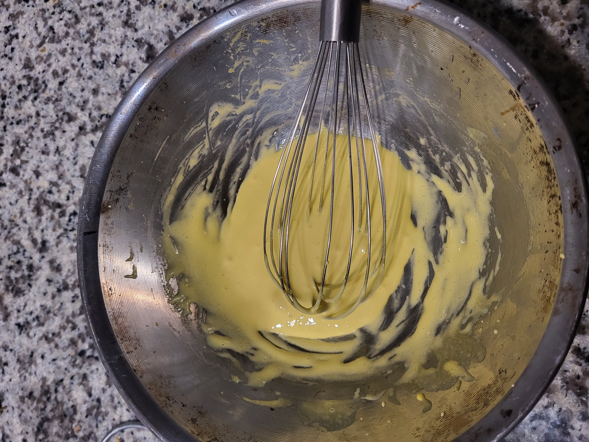
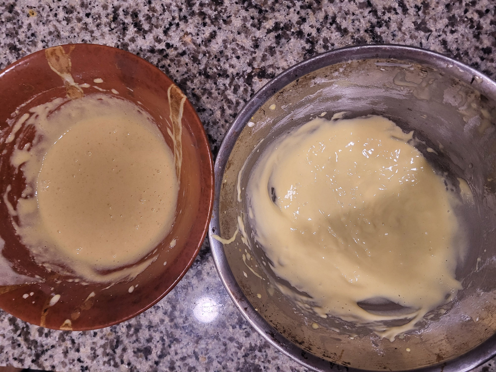

Learning my family recipe for an apple cake, my grandma used to bake every few days from fresh apples in the village. The magical sweet vannila-y scent of fresh baked apples is a distant warm happy memory. Each room in our village house was shared a corner of the great wood-fire oven. As my grandmar would cook breakfast and dinner in the oven it would warm up each corner of the house during the colder months. Not sure how my grandma would keep the house from feeling like a furnace during the warmer months though.

Regardless, the magical moment of waking up on one of the first days of the summer vacation, sun finally illuminating everything around yourself, with no burden of homeworks to worry about, the entire summer ahead of yourself, adventures in the forrest awaiting. And my grandmother would wake me up with a beautiful fresh cake.

Now that I think about it, it must have been the end of the summer, since the earliest apples would show up in August, but this is how I remember that feeling - carefree joy, sun, freedom and my grandmas apple cake.

I finally got my mom and my grandma to revise this recipe and prepare the recipe with their annotations for my use. I am hoping to also supplement this recipe with a variation from my grand aunt.

My moms recipe:

1. форму змазала маргарынам (можна маслам). Яблыкі лепш кіслыя
1. spread margarine (could use butter). Sour apples are best

2. Цеста: 3 яйкі, 1 шклянка (200г) цукру (лепш менш, калі яблыкі не кіслыя), 2-3 сталовыя лыжкі смятаны, 1 шклянка (прыкладна 160г) мукі, 1 чайная лыжка (5г) соды (гасіла воцатам) ( можна замяніць разрыхліцелем цеста, але я не спрабавала). Цеста мусіць па кансістэнцыі быць, як густая смятана
2. Batter. 3 eggs, 1 cup (200g) sugar (less is better if the appleas are not sour). 2-3 tablespoons of sourcream, 1 cup (160g) of flour, 1 teaspoon (5g) baking soda (reacted with vinegar) (can be substituted with baking poder, but I haven't tried). The batter must be similar consistency to thick sour cream.

3. запекала пры 180 - 200 градусах хвілін 35, але ж гэта залежыць ад формы
3. bake at 18-200 degrees celcius for 35 minutes, but the timing depends on the pan

4. Цеста я міксую ў камбайне: ўсё паступова дадаю, спачатку яйкі з цукрам, потым смятану, муку, соду (ці разрыхліцелем разам з мукой). Мне так прасцей, але натуральна, што можна і рукамі
4. The batter I prepare in a mixer: add all ingredients one-by-one, first eggs with sugar, then sour cream, flour, baking soda (or baking powder with flour). I find this easier, naturally, but could be prepared by hand.

Now on we go to my first attempt. I do not own a mixer like what my mom uses for her recipe, and instead of mixing all ingredients at once, I opted to use my regular technique of separting the eggs, beating in some air into yolks with sugar, and separately beating the whites with sugar, then adding sourcream to the yolks, beating in more air, then combining the whites with the yolks, not being overly careful about folding since I was not trying to create a crazy airy since I will still be adding a small ammount of baking powder to the mix to help them rize some more.

I had 2 eggs, and scaled the original recipe to 2/3. The ingreients were as follows:

2 eggs
133 g sugar
1 2/3 tablespoons sour cream
107 g flour
2332​ teaspoon baking powder

However, upon measuring the sugar, I realized 133 grams of sugar seemed a bit excessive, and I reduced it to 65 grams which seemed appropriate. Half the sugar went into the yolks and the other half into the whites.

Next, I had two different kinds of apples - the traditional in many american apple recipes Granny Smith and my snack of choice the delicious Cosmic Crisp apple. while normally I wouldn't peal appeles of a receipe like this, I would also be using smaller cupcake tins for separating various experiments, which could effectively reduce the baking time, and lead to less softening for the peals. Thus for this particular batch I decided to have the apples pealed.

Lastly, I was curious to adapt this recipe to the needs of a celiac audience and see how the recipe would compare. I had some gluten free mix laying around from my previous experiments. The mix was an amolgamation of leftovers from several recipes, but was likely close to the following ratio: 12 tapioca : 9 sweet rice : 7 almond : 2 coconut : 1 milk powder. Half the batter was prepared with regular all purpose flour and the other half with an equivalent ammount (53 g) of the gluten free flour.

Each cupcake space was filled with ~2 slices of apple and filled 2/3 of the way with batter. It was a bit tricky to get the batter to flow into the crevices of such small space, and perhaps would be much easier had I used proper baking springform pan, but it seemed to have worked either way.

Now to the final results - granny smith apples take the cake (pun intended). Gluten free batter worked extremely well! I can see how additional sugar would help, but I am still on the fence - I think increasing it by another 10-15 percent (60-65% of the original ammount) would be ideal. Also, I am used to recipes having butter and using salted butter to add the reuired salt to help bring together the flavors. In this case, since butter is not used, next time I should definitely add a pinch of salt to the batter. Lastly, I used way too little baking poswer - next time will have to use more. THe cakes definitely had air, but remained on the denser side.

Now, this batch was intended as an experiment and I had my tasting with some homemade vanilla icecream. However, in the future revisions will definitely have to use some vanilla (just a splash) in the batter.

Lastly, perhaps I should be more gentle folding the egg whites. Although, in my defense, the task of whipping two egg whites with half the recipe sugar into stiff peaks proved gargantuan for my little battery-powered frother which was naively employed for the task, resulting in what can only be described as not-even-soft-peaks stage. In future, proper whisking is a must-try, hard peaks and folding into batter for proper aeration. Otherwise, more baking powder should also do the trick.

I doubt this is the last time I set to fill my apartment with the beloved scents of a childhood memory (perhaps I can cover my smoke alarm next time and throw in a few pieces of birch or oak for authenticity (joking...)).

