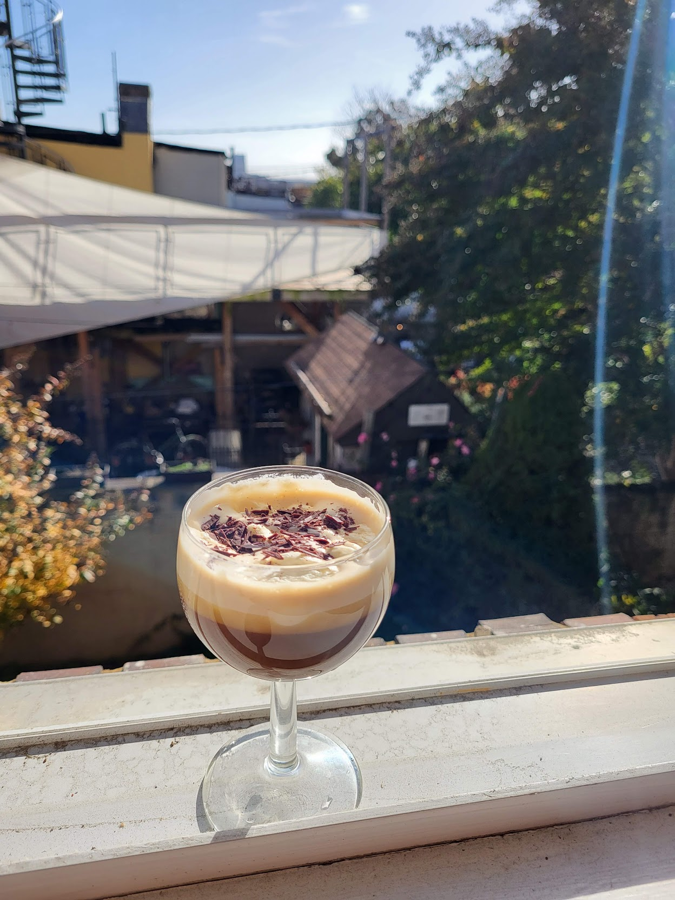
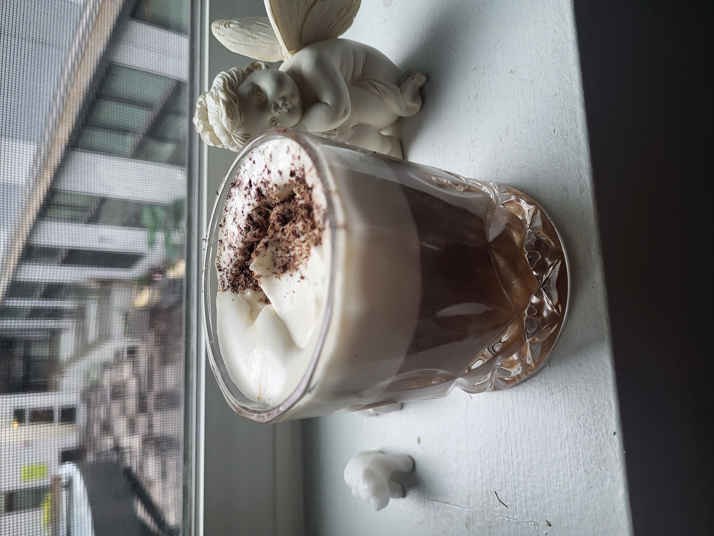

This recipe is an evolution of my favorite treat drink. In the abscence of an espresso machine, I grew to appreciate and love the quality of coffee using a humbler moka pot. For a separate story and my journey of exploring the moka pot, you can view the dedicated recipe here. Here, I want to share my current recipe for preparinga slightly buzzy weekend treat of a drink. Unlike many other recipes out there, this preparation has evolved to contain a bare minimum of alcohol, which gently mixes with the other flavors in the drink rather than overpowering them.

**Figure 1:** Initial setup many years ago. This prepartion used less refined coffee technique and was more alcohol-forward.

