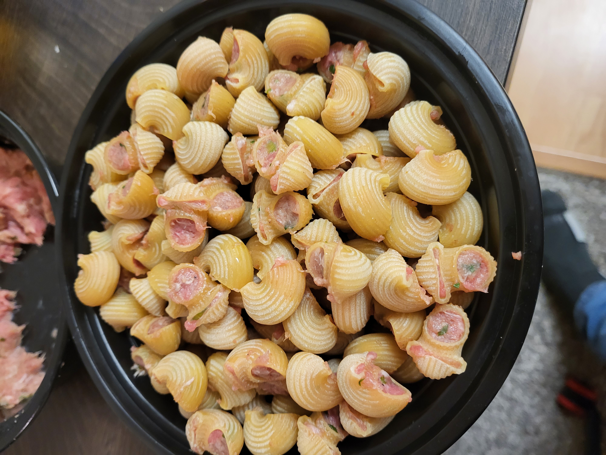

Pasta variants have evoleved across the globe as affordable, easily preservable nutritionally-dense foods. The process of making pasta lends itself to stuffing either the finished or intermediate products with various fillings as means of further expediting cooking of nutritionally complete meals. From raviolli to dumplings, stuffed canneloni, cheburek, etc we see varietals of this technique present all over the world.

In the early 90s after the collapse of the USSR, most produce with in high demand and rarely acceptable. Products with stable and long shelf-life were efervescent. My family evolved its own recipe Pelmaki during that time to keep our freezer stuffed with yummy dumpling-like objects.

Unlike many other dumpling recipes, this one is very interesting in that the filling is exposed to the boiling liquid. As the pelmak is cooked, the water is not only enriched with the free starches released by the pasta, but also the juices seeping out from the feeling, creating and aromatic and flavorful broth.

The pasta shaped used by my family was specifically lumache. For whatever reason, this shape, fairly unusual in the US was very common in Belarus when I was growing up. The shape translating to snails, looks similar with a clean opening on one side and a pinched opening on the other. This made tightly stuffing the dried pasta quite easy without the "guts" spilling out the other side. A clear indication that you stuffed it just right was when a tiny bit of the filling would squeeze out like two horns out the edges of the pinched side. If understuffed, the water would immediately get into the crevisces between the feeling tand the shell and dislodge the filling out into the water, if too much force was applied - it would be easy to break the shell.

The pastas available back home were good quality but not what one would call artisinal these days. No signature marks of the bronze cutting dies being used in the fabrication of it, yet the lovingly stuffed "snails" were delicious nonetheless, and if occasionally a few fillings did get dislodged in the boiling process, it was a fun game to find them and eat them first (or last as a "reward").

These days, with a wide variety of pastas available, opting for a slightly higher quality has been my general preference. The signature rough texture imparted by the bronze cutting dies, seems well suited for this specific application, binding the shell to the filling more strongly and forming a better slurry for a saucy emulsion with your favorite cheeses and spices at the end. It is a recipe which demands a good movie and a glass of wine to sit through and lovingly stuff each tiny snail. Unlike dumplings, the shapes are much smaller and tike a bit longer to make a sufficient ammount of. For that reason, it is not a frequent addition to my freezer, and I don't mind spluging a few extra dollars on higher quality pasta these days.

WHile it may be fun to discover dislodged meat nuggets in the broth and have some empty shells floating around full of saucy goodness, I would like to be able to control the extent to which meat can hold on to the pipe lining. I begin with a few hypothesis for what might be causing the dislodging behavior. With exception of a failed recipe in which the filling or the shells disintegrate alltogether, there are two things which may cause the separation of the two components: it is either a) the filling shrinking or b) the shell expanding. Both of these factors would cause separation of the components. I would like to find a way to control the extend to which either we control the loss or the binding of the two components with each other.

Shrinkage of the filling would primarily be caused by the loss of mass either via fat rendering or water leakage.

For the second, while there is no way of preventing the pasta from increasing in volume due to water absorption, I hypothesize that there might be a way to control for it, by increasing the concentration of starches in the expanding area between the pasta and the filling.

I sourced 1 pound of ground pork (85/15) and 1 pound of ground beef (90/10). In the future, it owuld be interesting to also test how the percentage of fat influences the results. Fat being an important vessel for flavor, and ideally, being able to trap tiny pockets of fat that would get rendered during cooking but not leak into the broth entirely would be ideal (akin to the butter trapped inside the perfectly done chicken kiev). However, I assume, this may not be possible. This is what makes dumplings so delicious, especially soup dumplings, because the full enclosure of the gluteny dough helps trap the liquids that are being redenred on the inside to explode the full flavor only once opened. With pelmaki, by definition, the enclosure is open, so we have to trap flavor either on the inside of the filling somehow, or give up and let it enhance the broth and enjoy it as a complete dish where leakage is encouraged.

Did you know meat can be kneaded much like a dough? When pounded or heavily worked, meat fibers are pulled from small cuts of meat in the ground meat, aligned much like the strands of gluten to form a fairly stretchy dough. Perhaps I should delve into the biochemistry of this process. Kneading can be a desired for some recipes where structural integrity is essential (kebab holding onto the skewer on an open flame), or undesirable (soft, crumbly and meaty burger patty). So the first factor I would like to test is whether kneading the filling has effect on the sticakge to the insides of the pasta

Eggs are frequently added as a binding agent to the foods. The albumin in the whites helps create a matrix of long protein fibers holding onto other components and keeping them together (this is what let's us whip the egg whites by trapping air within the lattice). The yolks contain lecithin a powerful emulsifier which helps us bind fat soluble and water soluble components. Lecithin from egg yolks is what let's us build emulsions such as mayo. Hence, I hypothesize that addition of small ammount of egg might help the dough maintain it's structure and potentially the surface proteins of the filling being able to bind with the free starches on the inside surface of the pasta shells.

Lastly, the pasta itself can be vastly different. Traditionally made pastas are extruded through bornze dies under high pressure. The pasta dough itself is made with coarser semolina flour and the extrusion process creates slight flakes on the surface of the pasta. These increase the surface area of the pasta, helping it release more starch into the liquid. These starches, is what let's us create pasta sauces by emulsifying the starchy water with othe ringredients, such as guancale fats, parmesan, pepper, tomatoes, etc. Since the same starches will also be dissolving and absorbing liquids on the inside of the shells, absorbing th emeat juices and filling in the space between the two components, i expect higher concentrations of it imparted by bronze extrusion of traditional pasta to help it retain the filling as well.

While preparing the four batches I realized that testing for the addition of flour to the filling is necessary. it was on my original list of tests, then discarded to simplify the experimental design and reduce the testing space, but I realized it is necessary nonetheless. Flour, in this case gluten-free tapioca starch/flour is an absorbent, much like the starches released by the pasta itself. However, unlike the starches released into the water by the pasta, adding flour to the filling directly serves to hopefully capture any liquid juices that may otherwise leak out into the cooking liquid. In this way retaining water by absorption should help us retain the total volume of the filling inside the pasta, and perhaps even increase it slightly due to the increase in size of the starch molecules as they bind to the liquid and absorb it not only from the meat itself but perhaps also from the cooking liquid. It is a theory though and remains to be tested.

In this initial testing there is a total of 2**4 = 16 combinations we could be testing using these three factors. However, to reduce the number of experiments, I would like to reduce this down to 8 experiments as follows.

Experiment	Kneading	Egg	Flour	Pasta
1	Kneaded	Yes	With	Smooth
2	Kneaded	Yes	Without	Extruded
3	Kneaded	No	With	Extruded
4	Kneaded	No	Without	Smooth
5	Not Kneaded	Yes	With	Extruded
6	Not Kneaded	Yes	Without	Smooth
7	Not Kneaded	No	With	Smooth
8	Not Kneaded	No	Without	Extruded

In the future I would like to explore additional factors such as the meat (pork vs beef vs 50/50), fat content (80/20,85/15,90/10), addition of flour, addition of onion, etc. But those experiments are for the future.

Understanding how all of these factors influence the structure of the meat will hopefully let me better choose and dial in the preparation for various recipes such as cepelinari, meatballs, etc

3g white pepper
3g black pepper
2g garlic powder
1.5 g MSG
salt to taste

Some ammount of kneading is inherent to mixing the spices into the meat, and can not really be avoided much. But I mixed it as little as necessary in order to incorporate the ingredients

1/2 egg + 1/2 no knead. 1/2 egg + 1/2 kneed

5g tapioca per 1/4 mixture

**Figure 1:** 

