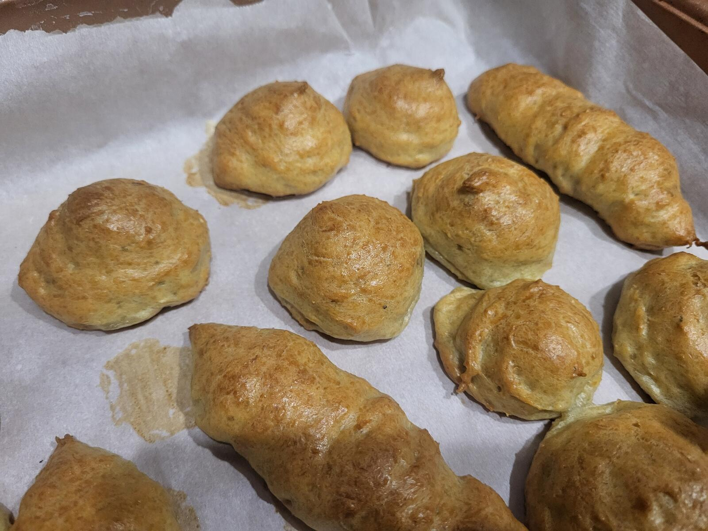
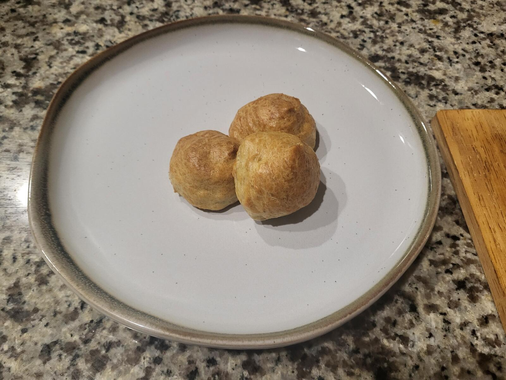

Every once in a while, I have this little Belarusian voice in my head telling me to find ways of integrating potatoes into the most un-potato-y of recipes. Out of the blue, I thought to myself — I really like choux pastry (one of my favorite baked goods; so rich yet so fluffy, and the process of it expanding into a hollow ready to welcome any filling is just too tempting) — but I’d like to share my joy with my partner, who is unable to indulge in all things gluten.  

What if, for no obvious reason, I replaced wheat in the recipe with potatoes? After all, potatoes have protein and can be made into mochi-like, doughy, and stretchy things (think Italian gnocchi or Nigerian fufu). This seemed like one of those times when my mind decided to take itself on a weird spin.  

That is until I realized I might also be part French for all I know — since the French have figured this out a while ago and beautifully termed it *Pommes Dauphine*. Alas, the original recipe still calls for flour. But that got me thinking: what if, using the chemical breakdown of potatoes (as it’s widely documented in many sources — let’s just use this literature review of potato nutrition from 2024 by Zuzana Havlíčková, citing *Potato Science and Technology* by Leszczynski from 1989 — why am I not surprised to see all fellow Eastern European names here?), we can get the average values for a potato as follows:

| Component | Percentage |
|------------|-------------|
| Water | 76.3% |
| Starch | 17.5% |
| Protein | 2% (or ~8.4% of total dry mass — closer to the 8–18% protein in wheat flour) |
| Other nutrients | Remainder (vitamins, minerals, and other components that make potatoes healthy and quite satiating overall) |

Now let’s take a typical choux pastry recipe (courtesy of [King Arthur Baking](https://www.kingarthurbaking.com/recipes/pate-a-choux-recipe)), which calls for:

- 227 g water (60%)  
- 113 g butter  
- 150 g flour (40%)  
- 4 large eggs  

Hmmm... this doesn’t bode well. We need 40% dry matter from flour, but we only get ~20% from potatoes, which are ~80% water. So what can we do?  

I propose that we shred potatoes directly into the melted butter, and as the mixture cooks, excess water will gradually evaporate. This process will, of course, take longer than cooking flour into the water-and-butter mixture in traditional choux pastry — but hey, we aren’t here to make life easier; we’re here to do some wanky food science!

The rest of the setup is quite simple.  

Since the water is evaporating and the dry mass of potato remains the same, we’ll go from there. For 100 g of potato, we get ~76 g water and 24 g dry mass. So we need to scale the rest of the ingredients to 24 g of dry mass. This gives us:

| Ingredient | Scaled Amount |
|-------------|----------------|
| Water | 36.3 g (reducing from ~76 g in the potato) |
| Butter | 18.1 g |
| Eggs | 0.64 (about two-thirds of an egg) |

My potato happens to weigh ~400 g (peeled), but that would scale to ~2.5 eggs, so let's trim potato for some soup and scale to 2 whole eggs instead, giving:

| Ingredient | Amount |
|-------------|---------|
| Potato | 312 g |
| Butter | 56.6 g |
| Eggs | ~2 |

I guess we’ll have to be precise on this one for the sake of the experiment.  

Or! We can squeeze the juice out of potatoes, let any starch precipitate and discard the required amount of water before recombining everything together with butter! much easier. So based on the current proportions, we discard ~125g of water to make final proportions roughly equal the flour recipe.

Let’s try it now — what could go wrong on the first attempt? (A lot, but I’m doing it to entertain myself, hopefully gain an ounce of new food understanding, and maybe stumble upon that one-in-a-hundred crazy idea that actually works out amazingly.)

I was able to separate out **118 g of liquid** from the potatoes after letting the starches precipitate. That might actually be for the best — the potatoes are raw, and water will evaporate as they cook to doneness. Some liquid might even need to be reintroduced later.

Butter and potatoes smell heavenly.

### Initial observations
Needs more experimenting:

1. **Cooking the potatoes:**  
   The shredded potatoes didn’t cook properly in butter. Perhaps the solution is to shred them even finer and poach them in butter under a closed lid at very low temperature for a while.

2. **Handling the starch:**  
   I reintroduced the starch into the dough right away, which turned out to be a mistake — the immediate gelatinization created clumps that I could never fully dissolve into the egg mixture. I did this because several shreds of potato got mixed into the strained juice and would have remained uncooked. In the future, the juice should be strained through a fine strainer or cheesecloth to prevent any shreds from escaping.

3. **Texture issues:**  
   The mixture was a bit gummy — perhaps due to the starches, or perhaps due to the issues above. Next time, I’ll try shredding the potatoes even finer. If that still doesn’t work, baking the potatoes first instead of poaching them in butter might be worth testing.

---

Despite the lessons to be learned, the results are **remarkable**.

**Fresh Out-the-Oven:** After baking them at 375F for 35 minutes, this is what came out of the oven.

1. **They puffed!**  
   The pastries did rise — almost in the same way as their gluten brethren. Slightly increasing the proportion of eggs in the mixture and ensuring it’s fully homogenized might give them that perfect, airy shape. I noticed that pieces with lumps of starch didn’t rise as much, and since all pieces had at least some, it’s very possible that better mixing alone would make a noticeable difference.

2. **They’re genuinely delicious.**  
   Puffy, crispy, light, and flavorful — think of the taste of potato latkes, but baked instead of fried (granted, there’s plenty of butter in the batter). The result is a fluffy, puffy, crispy form reminiscent of a fresh éclair — phenomenal!  

   Fill them with tangy sour cream and chives, a savory mushroom pâté, or perhaps lox with cream cheese — the options are limitless. I honestly think making them sweet might also work, though that would probably call for a less savory potato variety.

To be updated shortly, as I can't wait to experience the flavor again soon.

**Plated:** Here is the first beauty shot on a plate. Still needs work, and hopefully next time around, I can share a photo of one open with a sizeable cavity on the inside.

# baking the potato
I was hungry after the gym and took a bite from baked potato before taking a photo of the final weight. But I did weigh it at 332g out of the oven