# Story
The basic premise for this recipe came to me while visiting the Dizzy Horse restaurant in Mila Illinois.

I was always a big fan of crepres. Growing up, this was a staple across my family. My mom, and both my grandmas each would quickly whip up a batch of crepes for a healthy breakfast. Preparing a large batch, eating some fresh for breakfast and making rolls with sweet and svory fillings to take to work and reheated later throughout the week made quick, healthy and craving-inducing experience. Man was I lucky...

Everyone had their own unique recipe, however the beutiful lacing of their crepes was always the aluring part.

Fast forward to now, and crepes are no longer such a frequent sight in my own kitchen, usually replaced by simple plain oatmeal or quickly assembled spring rolls. Further exacerabted by the intollerance for gluten which I need to account for. Lucky for me one of the traditional variations of this food in france has been crepes made out of buckwheat. Based on the slightly mucusy consistency when rehydrated, I imagine buckwheat probably has a high ammount of digestable fiber making it viscous and particularly well suited for this dish. Combined with nutritional benefits and amazing earthy flavors of the grain it can do wonders in many recipes. While very common in my childhood (more than rice or pasta perhaps), I didn't like it on it's own much. But nothing beats meatballs with buckwheat in tomato sauce... Those deserve their own receipe... Later, I discovered the wonderful world of soba (likewise made from buckwheat flour). Long story short, in my ind buckwheat crepes sounded like a fantastic component for both sweet and savory dishes.

I don't know why, but while visiting the Dizzy Horse my mind started brewing an image of soury matcha sauce for a desert of some kind. I guess, I've been on a hunt for a version of irish coffee but made with matcha and my tangy quince syrup. I tried and failed to create that drink multiple times, yet the taste I was invisioning kept occupying a considerable portion of my cooking brain region... And this time I thought, what if instead of heavy cream, I tried to whip sour cream and infuse it with matcha and syrup directly producing a single ingredient which can be used with something else not as a drink but as a fluffy condiment? 

Upon my return to my own kitchen, I tried this out with some leftover ingredients. First, turns out, sour cream is not easily whipped, but it can be done, and works better when cold and with added sugar. Hand whisking worked well, but I would prefer testing it with an electric whisk next time for a, hopefully, even fluffier product. The flavor, however, was fantastic, yet it demanded to be paired with something more substantial, something earthy and sweet that would make this whole thing work.

Fast forward a week of thinking, and the idea for buckwheat crepes filled with sweet adzuki beans, came to fruition. On a sidenote, in my first experiment with matcha sourcream, while the quince syrup did work well, it provided added tang to the already tangy sourcream. Instead, for my next test I decided to replace it with honey instead - honey works great with matcha for me and helps loosen up the sourcream similarly to the quince syrup. Lastly, to observe my obsessikon with the quince syrup and add additional pop of color to the final plate, I decided to try masserating some strawberries in the quince syrup, which turned out to produce a fantastic pairing.

# Recipe

## Crepe Recipe (inspired by https://recipe30.com/buckwheat-crepes.html/)

### Ingredients:
- 1 cup buckwheat flour
- 1 large egg
- 2 cups of water
- 2 tablespoons of salted butter

### Instructions
I followed the aforementioned recipe very closely. Instead of just melting the butter, I did brown it well. Othewise, when mixing the ingredients, instead of adding a full cup of water first, I added half with the egg, making whisking into homogenous consistency a bit quicker. When making the crepes, I used a small 8 inch non-stick pan. I tested making the crepes with and without additional butter in the pan, and had better success producing consistent lacing without added butter, but it was also within the margin of error. I liked both equally and would stick to using no butter in the future. The trick was to use decently strong heat. Also, I kept the batter out on the counter at room temperature for 1 hour and did not notice any issues when making the crepes. Make sure to cover prepared crepes to prevent dehydration.

It might be intersting to try toasting the buckwheat flour for an even eartier flavor profile. however, that might require some experimentation with liquid ammount due to dehydration. Also crepes are so thin already,e xposing much of the poured batter to the high heat, that the extra toasting might not be necessary.

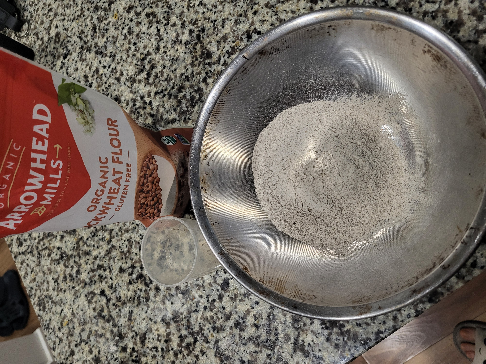
**Prepare Buckwheat:** Prepare buckwheat.

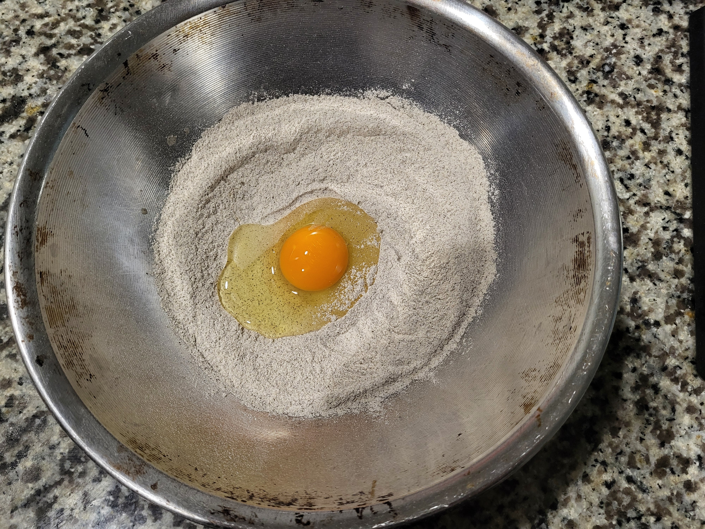
**Add Egg:** Add Egg to the flour.

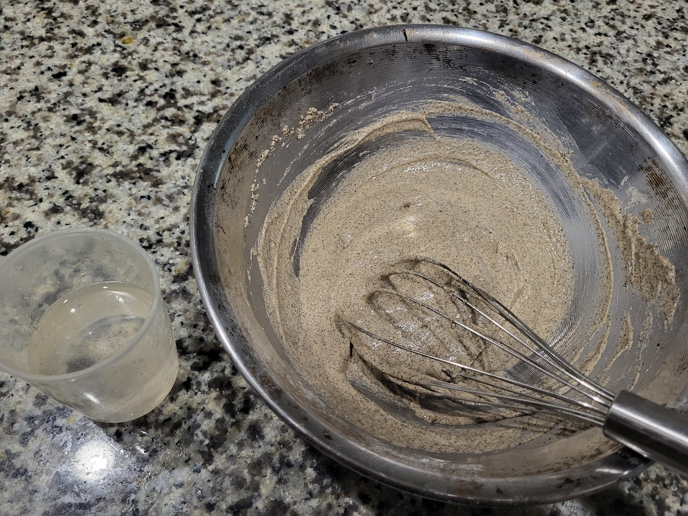
**Premix batter:** Whisk flour with the egg and quarter of the total water.

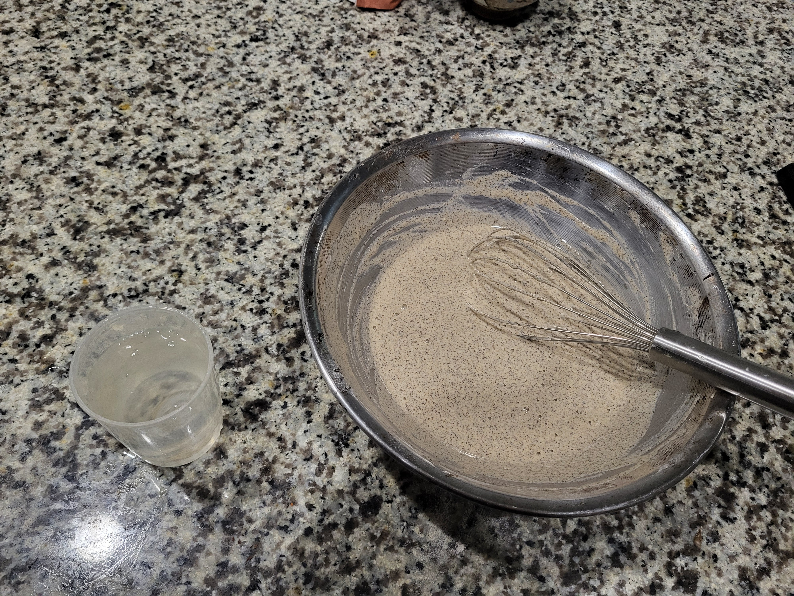
**Remaining water:** Add remaining water to the batter and whisk. Let stand covered for all flour to rehydrate and fiber to dissolve.

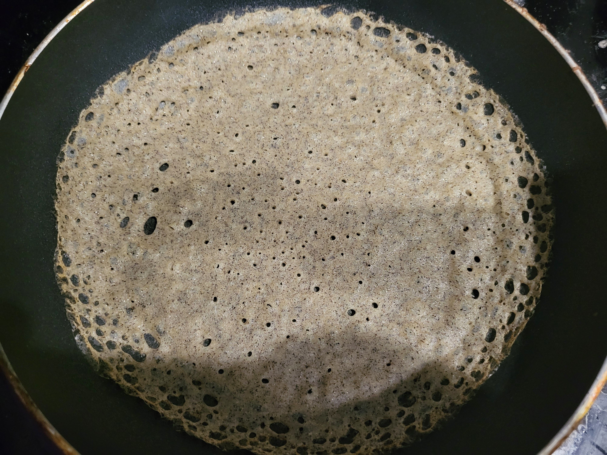
**Pour:** Pour enough batter onto dry non-stick skillet to cover the bottom with a thin film. The batter should immediately form bubbles which will pop shortly. If no bubbles - try increasing the heat.

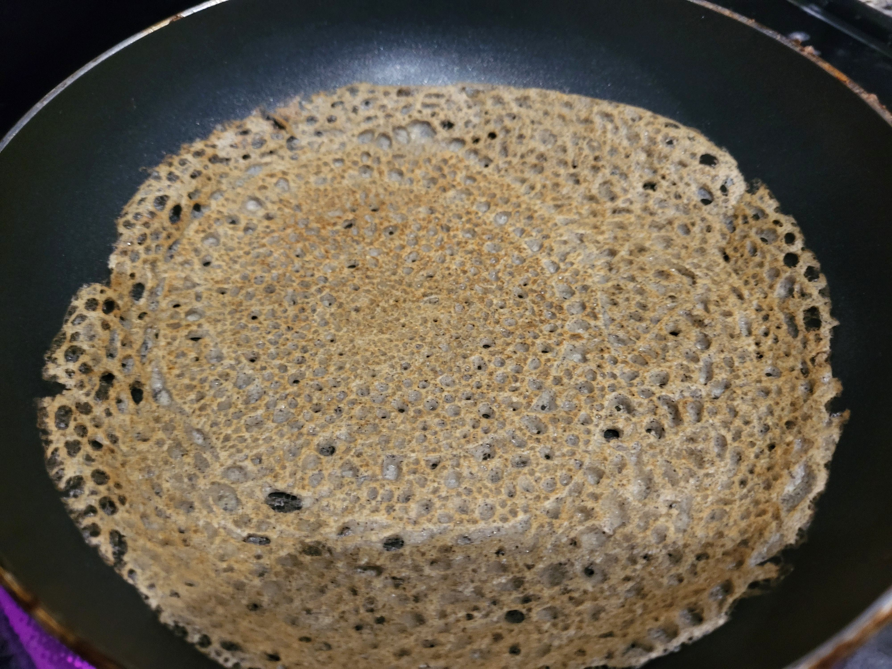
**Flip:** No need to wait long. The crepes are very thin and don't need more that 30 second after spreading. You will notice the edges comng off the sides indicating they are ready for the flip.

## Sour Matcha Whip Recipe

### Ingredients:
- 2 table spoons of sour cream
- 1 2/3 teaspoon honey
- 4 g matcha

### Instructions
In a metal bowl combine all ingredients and whisk into homogenous sauce. Cool it in the fridge or briefly in the freezer. Whisk heavily until thickens and get's visibly fluffy. I had success storing in the fridge for over an hour (didn't test longer times) without noticeable deflation.

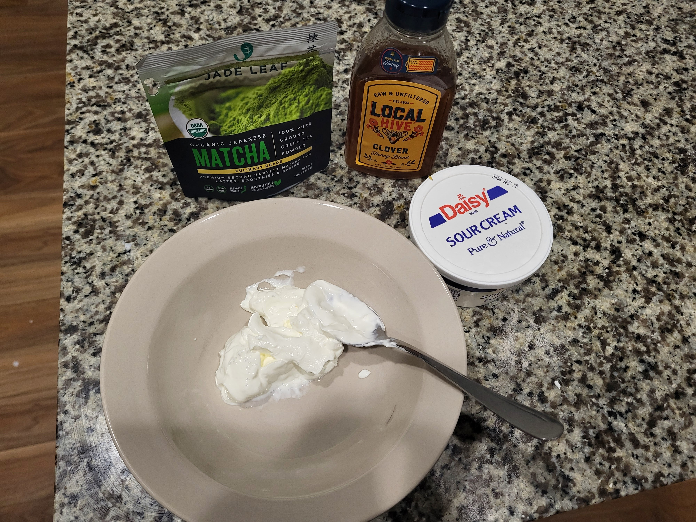
**Sour Matcha Ingredients:** Prepare ingredients.

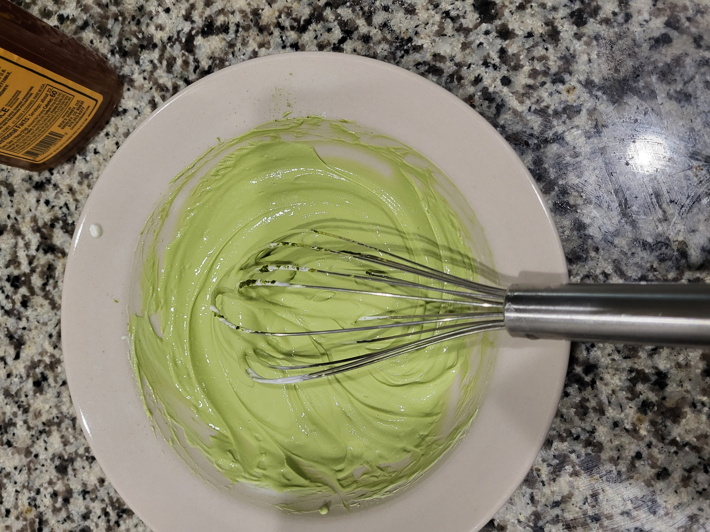
**Whip ingredients:** Combine ingredients and whip them together.

## Strawberry condiment

### Ingredients
- 5 strawberries
- 2 tablesppons quince syrup

### Instructions
Slice strawberries into slices and mix with the syrup. Let stand in the fridge for at least an hour. Strawberries should be softened.

## Putting everything together

### Ingredients
- 3 crepes
- 2 table spoons of adzuki beans
- 1 teaspoon of half-n-half
- 2 table spoons of Sour Matcha Whip
- 2 table spoons of masserated strawberries

### Instructions
Loosen up the adzui beans with half-n-half. Distribute across the three crepes spreading them on one end. Roll crepes. spread the sour matcha whip on the plate and decorate with the strawberries. Arrange the crepes on top and drissle the stawberry-quince syrup left over from the masseration.

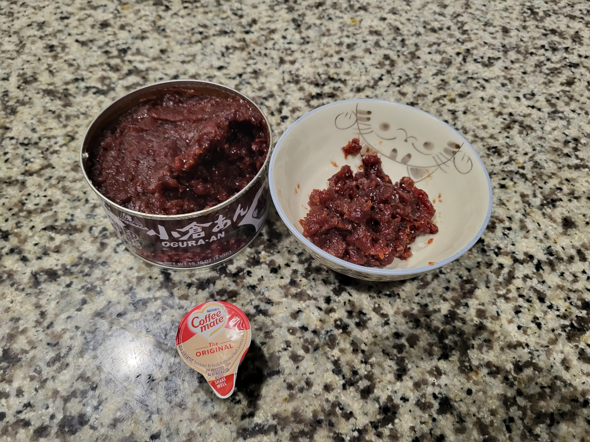
**Loosen Adzuki Beans:** Use half-n-half to loosen up the adzuki beans.

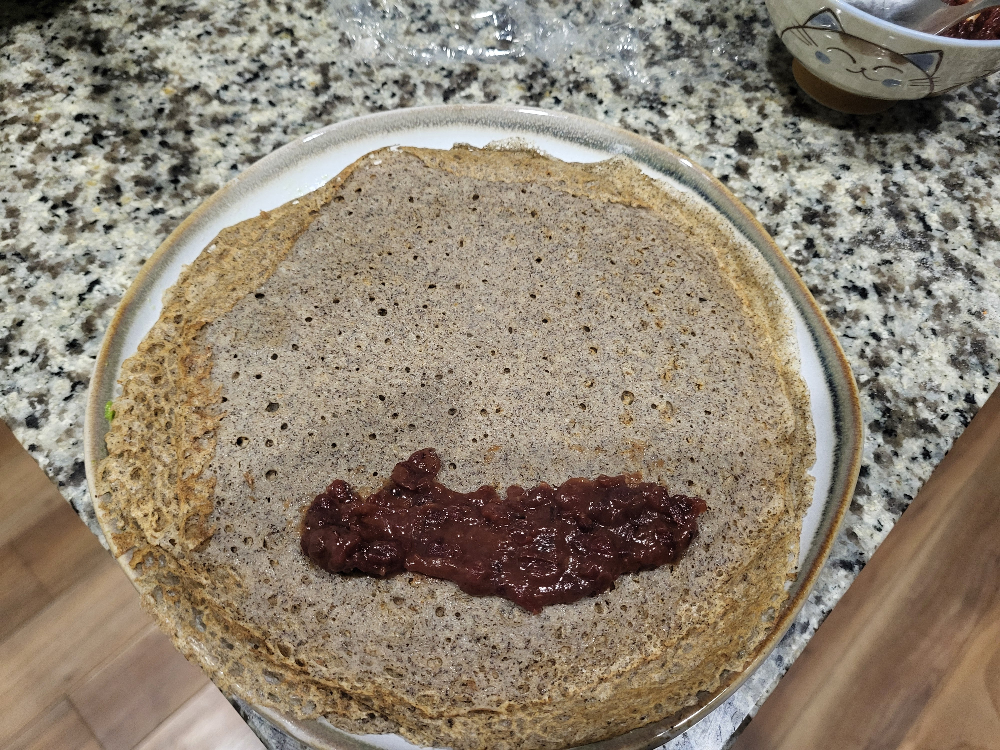
**Spreading Adzuki Beans:** Spread the adzuki mixture onto the crepes.

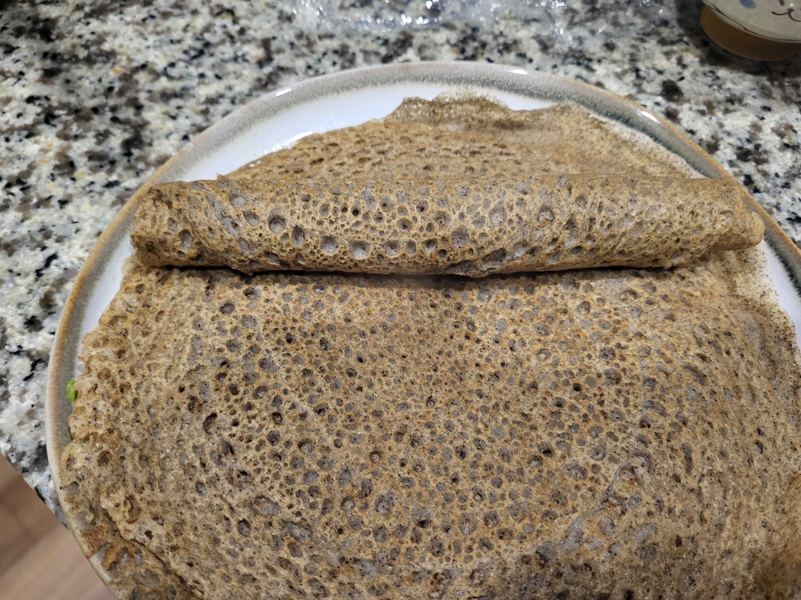
**Roll Crepes with Filling:** Roll crepes filled with the adzuki beans.

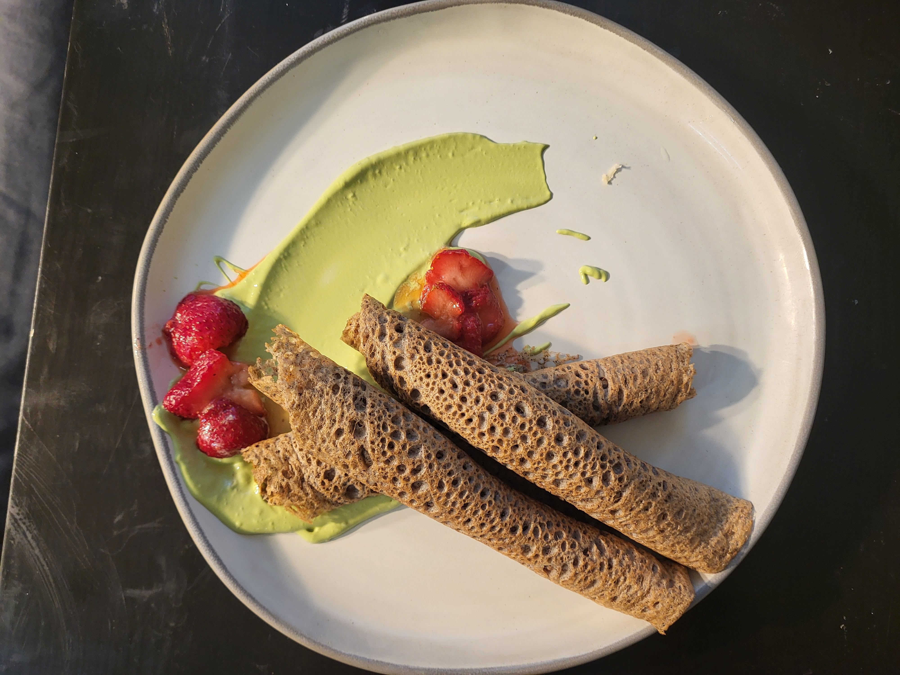
**Done:** Final product.

